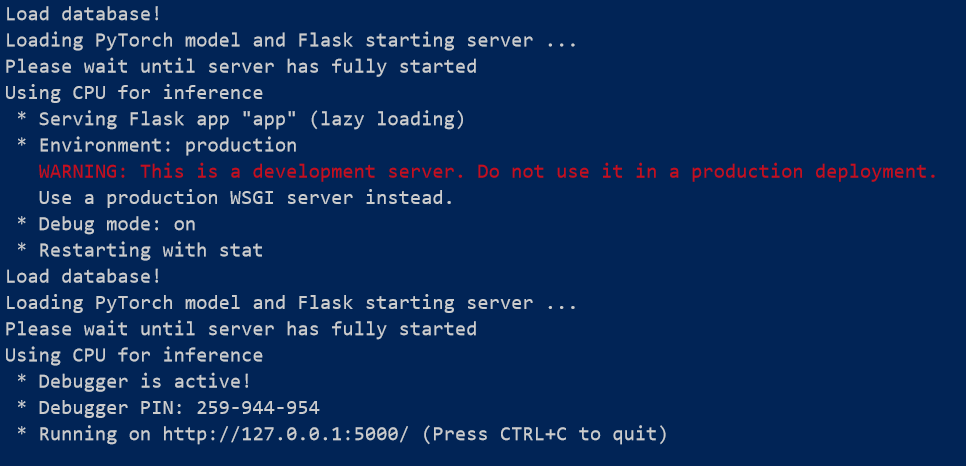

# flask_pytorch
using flask to run pytorch model

# start server
```sh
python app.py
```
you will see a result like this


# Acknowledgement
This repository refers to [deploy-pytorch-model](https://github.com/L1aoXingyu/deploy-pytorch-model), and thank the author again.