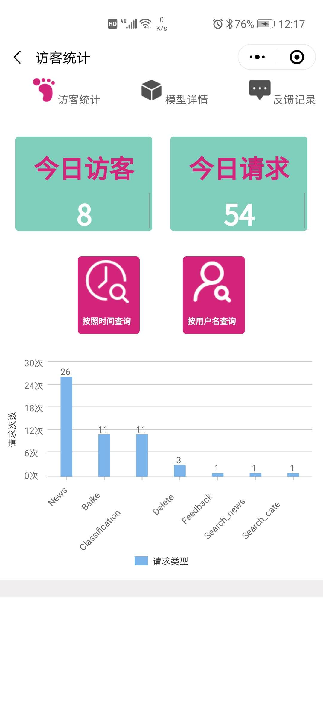

# flask_pytorch
使用Flask搭建Pytorch服务器                                                               [English Version](./README.md)

## 说明
1. 数据库端使用了两种方式，第一种是自己用pickle模拟的数据库操作，另一种是用mysql存储数据表，（前者不需要额外安装数据库可以用于简单测试，建议使用mysql版本的数据库，更加高效简约）；
2. 本项目可以和另一个代码库[小程序(OPEN SOON)](./)相互配合使用。

## 运行
**首先把训练好的模型‘model_best.pth.tar‘放到根目录下**
```sh
python app.py
```
启动后系统会自动查询爬虫是否有更新，第一次可能需要等待数据库更新。
> * Serving Flask app "app" (lazy loading) 
> 
> * Environment: production                                                                                                 
> WARNING: This is a development server. Do not use it in a production deployment.                          Use a production WSGI server instead.                                                                                 
> * Debug mode: on                                                                                                        
> * Restarting with stat                                                                                                 
> 检查更新                                                                                                                
> News has been checked!                                                                                                  
> Loading PyTorch model and Flask starting server ...                                                                     
> Please wait until server has fully started                                                                              
> Using CPU for inference                                                                                                  
> * Debugger is active!                                                                                                   
> * Debugger PIN: 259-944-954                                                                                             
> * Running on http://127.0.0.1:5000/ (Press CTRL+C to quit)

## 功能

1. 使用pickle模拟数据库操作或者使用MySQL数据库
2. 实时爬取西安资讯
3.  用户反馈
4.  用户上传图片预测结果反馈
5. 用户使用行为查询

## 前端示意

1. 用户查询

   

2. 类别介绍

   

3. 新闻资讯

   

4. 后台管理

   

## 结构说明

 **网络模型**：`./models`；

**数据库**：`./data/database/*`存储pickle格式的数据库，`./data/SQL/*`存储mysql格式的数据库，同时可以使用[transform_sql.py](./data/database/transform_sql.py)将pickle文件转换为对应的mysql数据表；

**用户数据**：`./uploads`文件存放用户的查询图片以及爬取的新闻资讯信息，`./uploads/cam`保存类激活图，`./uploads/category`保存所有类别的代表性图片，`./uploads/source`保存每个用户上传的查询图片，`./uploads/small`保存每个用户上传的查询图片的缩略图，`./uploads/news`保存爬取到的新闻资讯和图片，`./uploads/images`存放新闻资讯的封面图片，`./uploads/train`保存所有精选的训练图片，用于做特征匹配；

**百科**：存放爬取到的每个类别的百度百科，可以通过[baike](./util/baike.py)进行爬取和筛选。

## 配置文件
>base_url = 'https://****.com/'#部署公网在线服务，否则微信小程序无法显示图片
>
>base_url = 'http://127.0.0.1:5000/' #本地测试
>
>adminGroup = ['User1', 'User2', 'User3'] #管理员群组的微信昵称
# 相关
本项目参考了 [flask_pytorch](https://github.com/WenmuZhou/flask_pytorch).